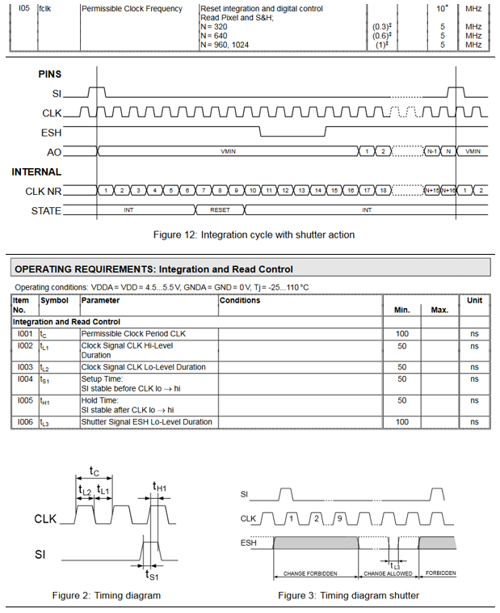
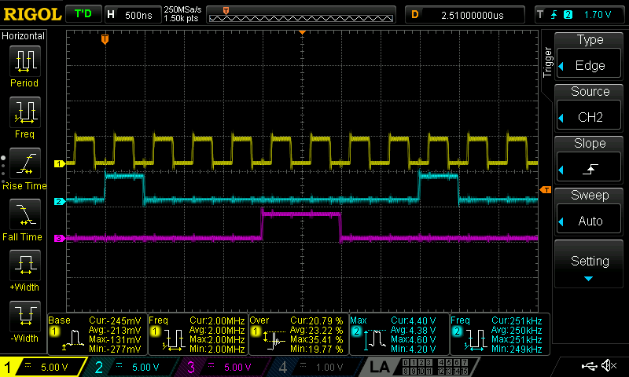

# STM32_PatternDriver
STM32F1 (64MHz) produces a repeating 2MHz bit pattern on multiple GPIOs (TIM, DMA, GPIO)

Project for STM32f103rb Nucleo-64 board clocked at 64 MHz

### Case Study: Pixel Clock and Shutter Action for Linear Image Sensor

#### Excerpt from Datasheet

Source: [ichaus.de/LFHxxx_datasheet_D1en.pdf](https://www.ichaus.de/upload/pdf/LFHxxx_datasheet_D1en.pdf)

### Waveforms on the Scope

